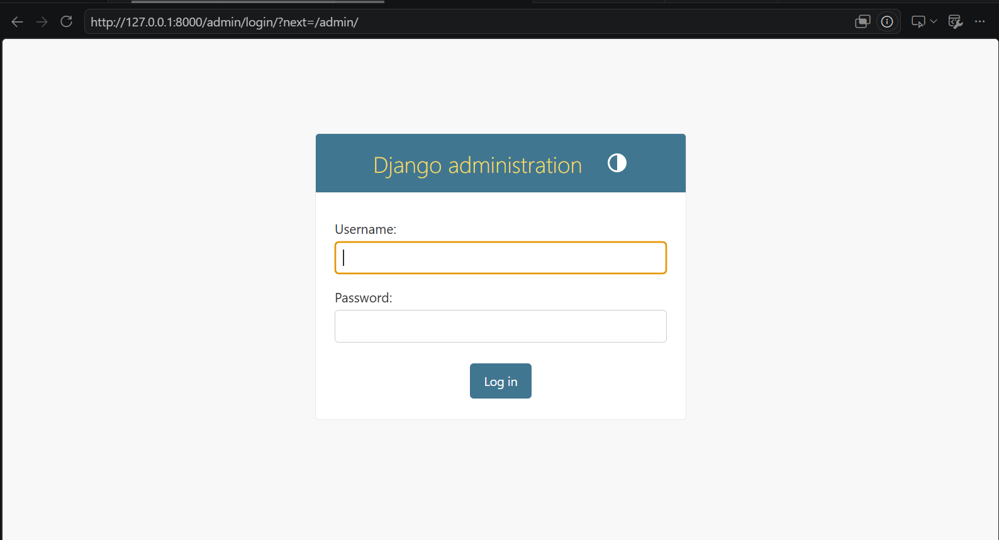
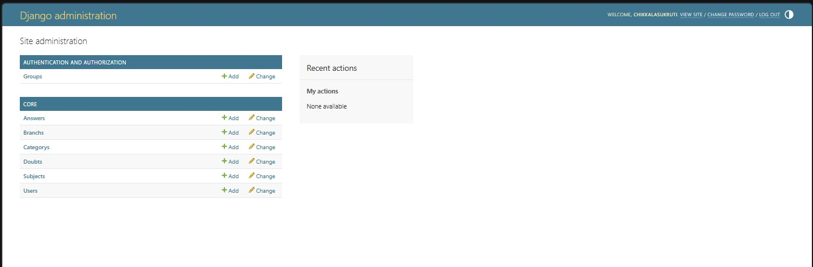
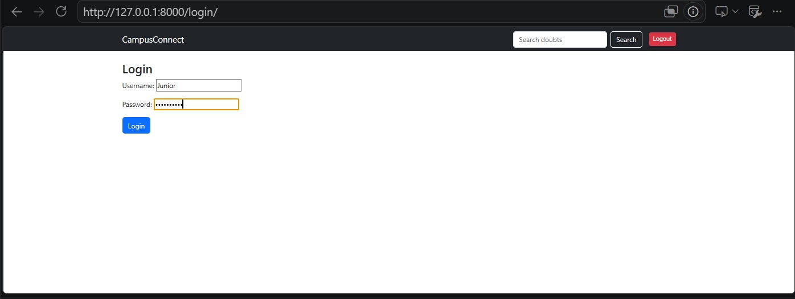
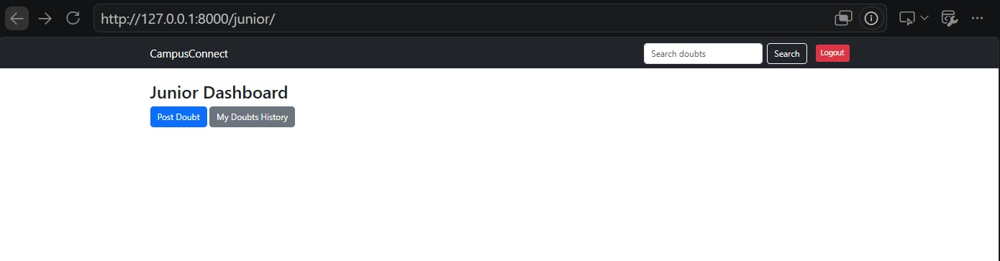
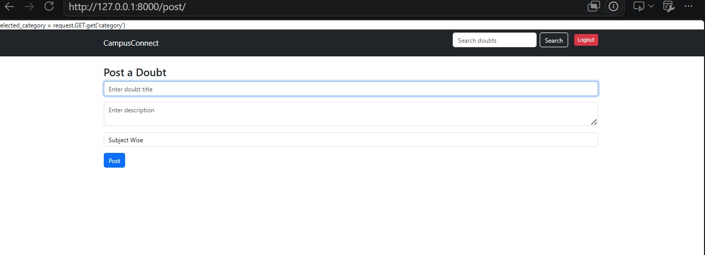
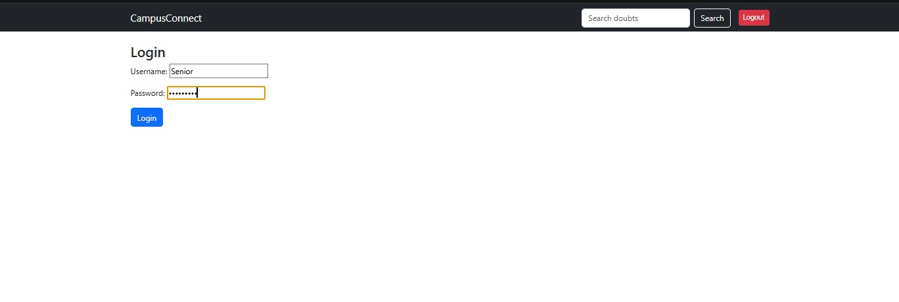
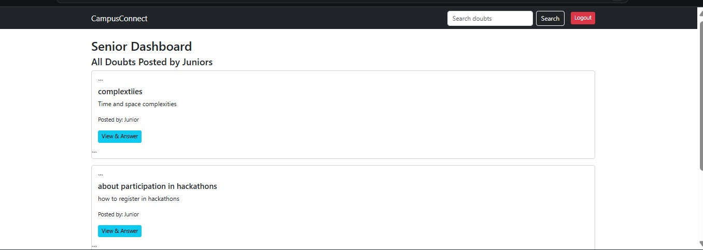

# 🎓 CampusConnect

A role-based **Django web application** that enables Juniors to post academic doubts and Seniors to answer them. The platform provides an organized environment for students to collaborate, discuss subject-related queries, and improve learning through peer interaction.

---

## 🚀 Features

### 👨‍🎓 Junior Module
- Secure Login
- Personalized Dashboard
- Post academic doubts
- Search existing doubts
- View answers from Seniors

### 🎓 Senior Module
- Secure Login
- Personalized Dashboard
- Browse all doubts
- Answer Junior doubts
- View complete discussion threads

### 👨‍💼 Admin Module
- Django Admin Panel
- Manage Users
- Manage Categories
- Manage Branches
- Manage Subjects
- Manage Doubts
- Manage Answers

---

# 🛠️ Tech Stack

| Technology | Used |
|------------|------|
| Python | ✅ |
| Django | ✅ |
| HTML5 | ✅ |
| CSS3 | ✅ |
| Bootstrap | ✅ |
| SQLite | ✅ |
| Git | ✅ |
| GitHub | ✅ |
| Render | ✅ |

---

# 📂 Project Structure

```
CampusConnect
│
├── campusconnect/
├── core/
├── templates/
├── static/
├── screenshots/
├── manage.py
├── requirements.txt
├── Procfile
└── README.md
```

---

# 📸 Application Screenshots

## 🔐 Admin Login



---

## 🛠️ Admin Dashboard



---

## 👨‍🎓 Junior Login



---

## 👨‍🎓 Junior Dashboard



---

## ❓ Junior Doubt Page



---

## 🎓 Senior Login



---

## 🎓 Senior Dashboard



---

# ⚙️ Installation

## Clone Repository

```bash
git clone https://github.com/ChikkalaSukrutiNaidu/campusconnect.git
```

## Move into Project

```bash
cd campusconnect
```

## Create Virtual Environment

```bash
python -m venv venv
```

## Activate Virtual Environment

### Windows

```bash
venv\Scripts\activate
```

### Linux / macOS

```bash
source venv/bin/activate
```

## Install Dependencies

```bash
pip install -r requirements.txt
```

## Apply Migrations

```bash
python manage.py migrate
```

## Create Superuser

```bash
python manage.py createsuperuser
```

## Run Server

```bash
python manage.py runserver
```

Open:

```
http://127.0.0.1:8000/
```

---

# 👥 User Roles

### Junior

- Login
- Post Doubts
- View Answers
- Search Doubts

### Senior

- Login
- View Doubts
- Answer Doubts

### Admin

- Manage Users
- Manage Branches
- Manage Categories
- Manage Subjects
- Manage Doubts
- Manage Answers

---

# 💡 Future Enhancements

- 🔔 Notifications
- ❤️ Like & Upvote Answers
- 📎 File Attachments
- 🔍 Advanced Search
- 💬 Real-time Chat
- 📱 Responsive UI
- 📧 Email Verification
- ⭐ Answer Rating System

---

# 📄 License

This project is developed for educational purposes.

---

# 👩‍💻 Developer

**Navya Pachigolla**

- GitHub: https://github.com/NavyaPachigolla
- LinkedIn: https://www.linkedin.com/in/navya-pachigolla-875458323

---

⭐ If you found this project useful, consider giving it a **Star** on GitHub!